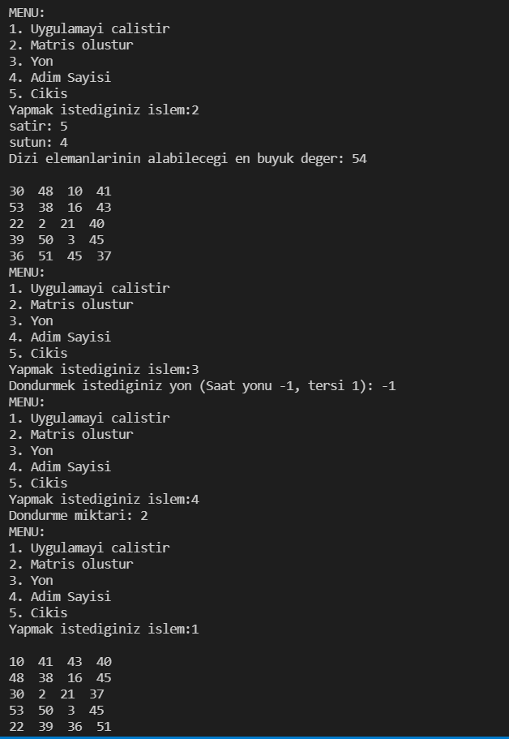

# Matris Döndürme
Kullanıcıdan matrisin satır sayısı, sütun sayısı, matris elemanlarının alabileceği en büyük değer parametrelerini alarak rastgele matris oluşturup kullanıcının istediği yönde ve sayıda matrisin kenarlarını döndüren program.

  

